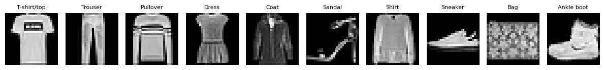

# Fashion MNIST Classification

Fashion-MNIST is a dataset of Zalando's article images—consisting of a training set of 60,000 examples and a test set of 10,000 examples. Each example is a 28x28 grayscale image, associated with a label from 10 classes. We intend Fashion-MNIST to serve as a direct drop-in replacement for the original MNIST dataset for benchmarking machine learning algorithms. It shares the same image size and structure of training and testing splits.

Here's an example of how the data looks (each class takes three-rows):

---

## Project Overview
This project demonstrates:

- Loading and exploring the Fashion MNIST dataset  
- Preprocessing images (normalization, reshaping, one-hot encoding)  
- Implementing:
  - **1️⃣ MLP Model** (Flatten → Dense Layers)
  - **2️⃣ CNN Model** (Conv2D → MaxPooling → Dense Layers)
- Training and evaluating models  
- Visualizing training performance  
- Generating **confusion matrix** and **classification report**  
- Making **sample predictions**  

---

## Dataset
Fashion MNIST contains **70,000 grayscale images (28×28 pixels)** of clothing items across **10 classes**:

| Label | Class |
|-------|-------|
| 0     | T-shirt/top |
| 1     | Trouser     |
| 2     | Pullover    |
| 3     | Dress       |
| 4     | Coat        |
| 5     | Sandal      |
| 6     | Shirt       |
| 7     | Sneaker     |
| 8     | Bag         |
| 9     | Ankle boot  |

Dataset is automatically loaded via [`keras.datasets.fashion_mnist`](https://keras.io/api/datasets/fashion_mnist/).

---

## Sample Data Visualization
Here’s an example grid showing **one sample per class** from the training set:

---

## Technologies Used
- Python  
- TensorFlow / Keras  
- NumPy  
- Matplotlib  
- Seaborn  
- Scikit-learn  
- Pandas  

---

## Model Architectures

### 1️⃣ MLP Model
- **Input:** Flattened 28×28 images → 784 features  
- **Hidden Layers:** 128 → 64 → 32 neurons (ReLU activation)  
- **Output:** Softmax (10 classes)  
- **Test Accuracy:** **~88.18%**  

**Use case:** Good baseline model for tabular-like flattened image features.

---

### 2️⃣ CNN Model
- **Layers:**
  - Conv2D(32, kernel_size=3×3) + MaxPooling(2×2)  
  - Conv2D(64, kernel_size=3×3) + MaxPooling(2×2)  
  - Flatten → Dense(128) → Dense(64)  
- **Output:** Softmax (10 classes)  
- **Test Accuracy:** **~92.02%**  

**Observation:** CNN outperforms MLP due to spatial feature extraction and learning local patterns.

---

## Training and Evaluation
The notebook includes:

- **Training vs. Validation Accuracy & Loss plots**  
- **Confusion Matrix**  
- **Classification Report**  
- **Sample Predictions with Images**  

**Note:** Visualizations help to quickly identify model performance, highlight misclassifications, and interpret results efficiently.
